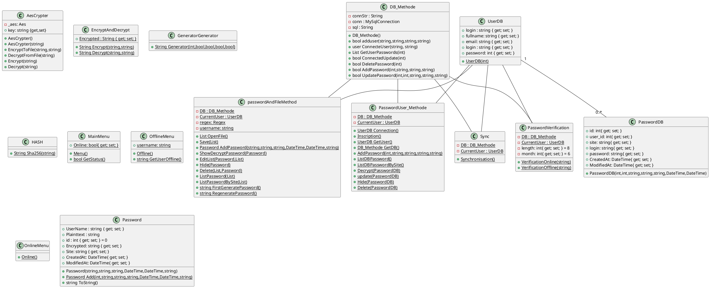

```plantuml

@startuml
class AesCrypter { 
-_aes: Aes 
+key: string {get,set} 
+AesCrypter() 
+AesCrypter(string) 
+EncryptToFile(string,string) 
+DecryptFromFile(string) 
+Encrypt(string) 
+Decrypt(string) 
}

class DB_Methode{ 
-connStr : String 
-conn : MySqlConnection 
-sql : String 
+DB_Methode() 
+bool adduser(string,string,string,string) 
+user ConnecteUser(string, string) 
+List GetUserPasswords(int) 
+bool ConnectedUpdate(int) 
+bool DeletePassword(int) 
+bool AddPassword(int,string,string,string) 
+bool UpdatePassword(int,int,string,string,string)
}

class EncryptAndDecrypt{ 
+{static}Encrypted : String { get; set; } 
+{static}String Encrypt(string,string) 
+{static}String Decrypt(string,string) 
}

class GeneratorGenerator{
+{static}String Generator(int,bool,bool,bool,bool) 
}

class HASH{ 
+{static}String Sha256(string) 
}

class MainMenu{ 
+{static}Online: bool{ get; set; } 
+{static}Menu() 
+{static}bool GetStatus() 
}

class OfflineMenu{ 
+{static}username: string 
+{static}Offline() 
+{static}string GetUserOffline() 
}

class OnlineMenu{ 
+{static}Online() 
}

class Password{
 +UserName : string { get; set; } 
+Plainttext : string 
+id : int { get; set; } = 0 
+Encrypted: string { get; set; } 
+Site: string { get; set; } 
+CreatedAt: DateTime{ get; set; } 
+ModifiedAt: DateTime{ get; set; } 
+Password(string,string,string,DateTime,DateTime,string) 
+{static}Password Add(int,string,string,string,DateTime,DateTime,string)
+string ToString() 

}
class passwordAndFileMethod{
-{static}DB : DB_Methode 
-{static}CurrentUser : UserDB 
-{static}regex: Regex 
-{static}username: string 
+{static}List OpenFile() 
+{static}Save(List) 
+{static}Password AddPassword(string,string,string,DateTime,DateTime,string) 
+{static}ShowDecryptPassword(Password) 
+{static}EditList(Password,List) 
+{static}Hide(Password) 
+{static}Delete(List,Password) 
+{static}ListPassword(List) 
+{static}ListPasswordBySite(List) 
+{static}string FirstGeneratePassword() 
+{static}string RegeneratePassword()
}
DB_Methode -- passwordAndFileMethod
UserDB -- passwordAndFileMethod
class PasswordDB{
+id: int{ get; set; }
+user_id: int{ get; set; }
+site: string{ get; set; }
+login: string{ get; set; }
+password: string{ get; set; }
+CreatedAt: DateTime{ get; set; }
+ModifiedAt: DateTime{ get; set; }
+PasswordDB(int,int,string,string,string,DateTime,DateTime)
}

class PasswordUser_Methode{
-{static}DB : DB_Methode 
-{static}CurrentUser : UserDB 
+{static}UserDB Connection()
+{static}Inscription()
+{static}UserDB GetUser()
+{static}DB_Methode GetDB()
+{static}AddPassword(int,string,string,string,string)
+{static}ListDBPassword()
+{static}ListDBPasswordBySite()
+{static}Decrypt(PasswordDB)
+{static}update(PasswordDB)
+{static}Hide(PasswordDB)
+{static}Delete(PasswordDB)
}
DB_Methode -- PasswordUser_Methode
UserDB -- PasswordUser_Methode
class PasswordVerification{
-{static}DB : DB_Methode 
-{static}CurrentUser : UserDB 
-length: int{ get; set; } = 8
-month: int{ get; set; } = 6
+{static}VerificationOnline(string)
+{static}VerificationOffline(string)
}
DB_Methode -- PasswordVerification
UserDB -- PasswordVerification
class Sync{
-{static}DB : DB_Methode 
-{static}CurrentUser : UserDB
+{static}Synchronisation()
}
DB_Methode -- Sync
UserDB -- Sync
class UserDB{
+login : string { get; set; }
+fullname: string { get; set; }
+email: string { get; set; }
+login : string { get; set; }
+password: int { get; set; }
+{static}UserDB(int)
}
UserDB " 1 "-- " 0..* "PasswordDB
@enduml
```